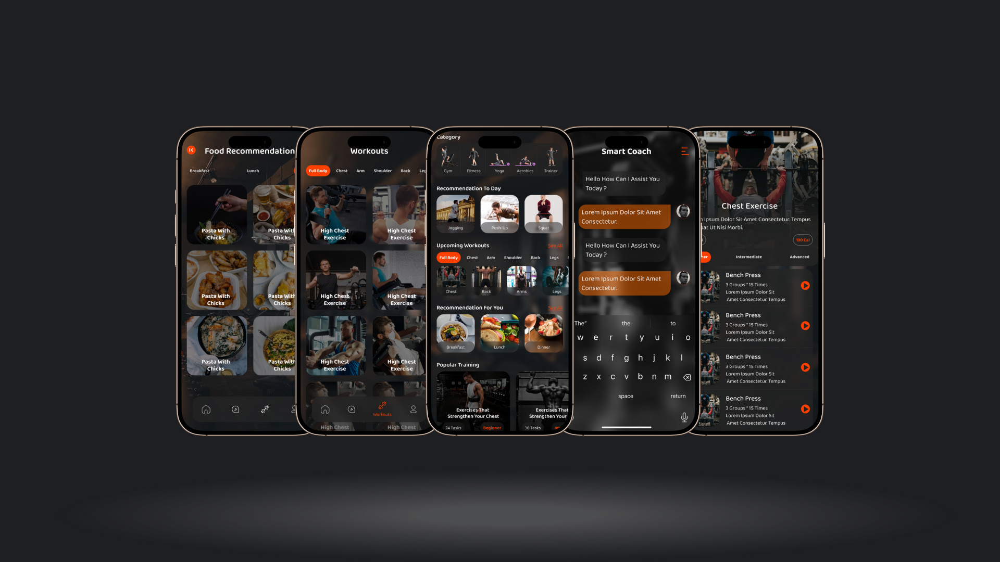

# PluseFit 🏋️‍♂️

**PluseFit** is a full-featured fitness and health mobile application built using **Flutter**, designed to help users track their workout routines, discover nearby gyms and services, and engage with smart coaching features.

> 🚧 This is the active development branch. The app is currently under construction.

---

## 📱 Features

- 🏃‍♂️ **Smart Coach**: AI-driven assistant for fitness guidance and habit tracking.
- 🧭 **Explore Nearby Services**: Discover restaurants, gyms, and shortcuts based on your location.
- 🔄 **Offline Caching**: Access essential data even when offline using Hive storage.
- 🧠 **Clean Architecture + MVVM**: Scalable and maintainable code structure.
- 🔐 **Onboarding & Auth**: Smooth user onboarding with custom onboarding pages and login/signup flows.
- 🧩 **Multi-Module Support**: Organized code with separate modules for core, domain, data, and presentation layers.

---

## 🚀 Tech Stack

| Layer              | Tech/Library                  |
|-------------------|-------------------------------|
| UI                | Flutter, Provider, MVVM       |
| Local Storage     | Hive                          |
| Dependency Injection | get_it, injectable          |
| Navigation        | Custom Route Manager          |
| State Management  | Cubit/Bloc + Clean Architecture |
| APIs              | Custom data sources (Remote & Local) |

---

## 🧪 How to Run the App

1. **Clone the repo**:
   ```bash
   git clone -b development https://github.com/ahmedragaae0120/PluseFit.git
   ```

2. **Install dependencies**:
   ```bash
   flutter pub get
   ```

3. **Generate necessary files (for injectable, json_serializable, etc.)**:
   ```bash
   flutter pub run build_runner build --delete-conflicting-outputs
   ```

4. **Run the app**:
   ```bash
   flutter run
   ```

---

## 📂 Project Structure

```
lib/
├── core/           # Constants, DI, Routing, Utilities
├── data/           # Repositories & Data Sources
├── domain/         # Entities & Use Cases
├── presentation/   # Screens, ViewModels, Widgets
```

---

## 📸 Screenshots

### 🏠 Preview App


---

## 🧑‍💻 Author

- Ahmed Ragaa — [GitHub Profile](https://github.com/ahmedragaae0120)
- kareem Hekal — [GitHub Profile](https://github.com/kareemHekal)
- Mariamshahir — [GitHub Profile](https://github.com/Mariamshahir)
- ehab mohamed — [GitHub Profile](https://github.com/ehabMohamedSalah)
- Marwan1137 — [GitHub Profile](https://github.com/Marwan1137)
- Aya allah Emara — [GitHub Profile](https://github.com/AyaallahEmara)

---

## 📄 License

This project is licensed under the [MIT License](./LICENSE). 
You are free to use, modify, and distribute this project for any purpose, with proper attribution.  
See the LICENSE file for full legal details.